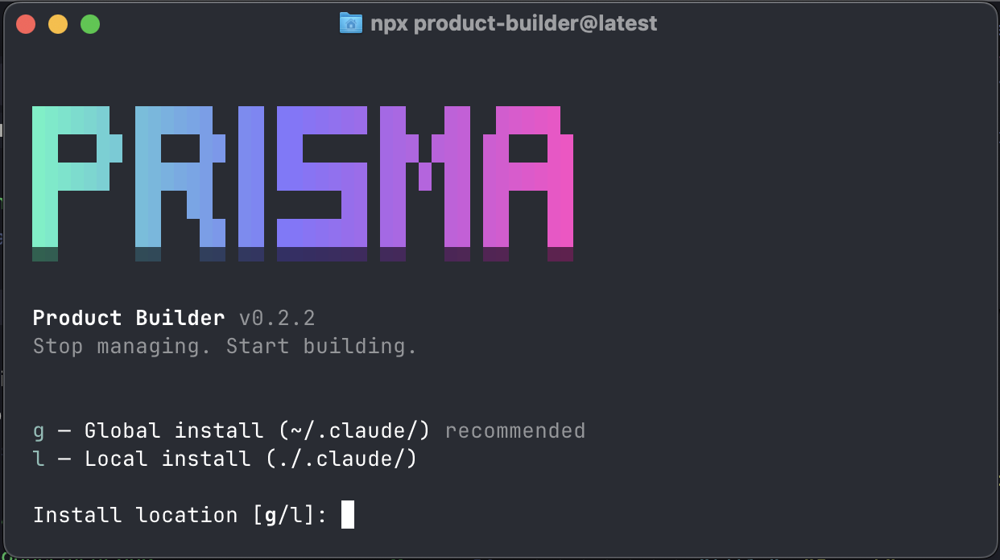

<div align="center">

# PRODUCT BUILDER

**Context-resilient system for transformation-driven product building with Claude Code.**

**Turns product managers into product engineers — from vague ideas to build-ready specs that survive context degradation.**

[](https://www.npmjs.com/package/product-builder)
[](https://www.npmjs.com/package/product-builder)
[](LICENSE)

<br>

```bash
npx product-builder@latest
```

**Works on Mac, Windows, and Linux. Requires [Claude Code](https://claude.ai/code).**

<br>



<br>

*"Products are transformation engines — people pay for the delta between states, not for features."*

*"The spec that degrades is the spec that fails. Every artifact must carry enough signal to build from — across sessions, agents, and time."*

*"The PM that ships is the PM that thinks clearly. Everything else is ceremony."*

<br>

[Why I Built This](#why-i-built-this) · [The Product Power Formula](#the-product-power-formula) · [How It Works](#how-it-works) · [Commands](#commands) · [Architecture](#architecture)

</div>

---

## Why I Built This

I'm a product builder from Latin America. I don't believe in product management theater — the endless docs nobody reads, the ceremonies that slow everything down, the PRDs that get outdated before engineering starts.

The world is shifting. Product managers are becoming product engineers. The ones who survive are the ones who think clearly, frame problems as transformations, and ship specs that don't degrade when they hand them off. But most PMs don't have the tools for this new era. They use ChatGPT with templates and call it "AI-native."

So I built Product Builder. It's a context-resilient system for transformation-driven product engineering — not a doc generator. Behind the scenes: Socratic questioning loops, multi-agent analysis, anti-pattern detection, framework application. What you see: a few commands that make you engineer better products.

The system doesn't just produce artifacts. It teaches you to ask the right questions. It catches you when you're solving solutions instead of problems. It forces you to score opportunities before committing resources. It kills features that don't clear the bar.

That's what this is. No management roleplay. Just an incredibly effective system for building products that matter.

— **Luis**

---

## Who This Is For

Product managers becoming product builders. People who want to engineer transformations, not manage feature lists — and need specs that don't degrade when they hand them off.

---

## The Product Power Formula

This is how you know if something is worth building. Score any problem or opportunity in 30 seconds.

```
Willingness to Pay = ΔState × Emotional Intensity × Problem Frequency
```

| Variable | Scale | What It Measures |
|----------|-------|------------------|
| **ΔState** | 1-10 | How large is the gap between current state and desired state? |
| **Emotional Intensity** | 1-10 | How deeply does the user feel this pain? |
| **Problem Frequency** | 1-10 | How often does the user encounter this? |

| Score | Tier | What It Means |
|-------|------|---------------|
| < 100 | Low | Nice-to-have. Hard to monetize. Kill it. |
| 100–400 | Medium | Viable product. Needs strong execution. |
| 400–700 | High | Strong opportunity. Clear willingness to pay. |
| 700+ | Exceptional | Category-defining. Build this immediately. |

Run `/pm:power` standalone — no project setup needed. Score anything in your terminal.

---

## Getting Started

```bash
npx product-builder@latest
```

The installer auto-detects your AI CLI and prompts you to choose scope:
- **Global** — Available in all projects (recommended)
- **Local** — Current project only

Supports: **Claude Code**, **Gemini CLI**, **Codex**, **OpenCode**. Use `--claude`, `--gemini`, `--codex`, or `--opencode` to target a specific runtime.

Verify with:
```
/pm:help
```

<details>
<summary><strong>Non-interactive Install</strong></summary>

```bash
npx product-builder@latest --global    # Install globally
npx product-builder@latest --local     # Install to current project
npx product-builder@latest --gemini    # Target Gemini CLI specifically
npx product-builder@latest --force     # Overwrite without prompting
npx product-builder@latest --uninstall # Remove installed files
```

</details>

<details>
<summary><strong>Updating</strong></summary>

Product Builder evolves fast. Update periodically:

```bash
npx product-builder@latest
```

Or from inside Claude Code:
```
/pm:update
```

</details>

---

## How It Works

### 1. Initialize Product

```
/pm:new "My Product"
```

The system asks about your vision, target market, and transformation thesis. It creates a structured workspace that every subsequent command reads from.

**Creates:** `.product/PRODUCT.md`, `STATE.md`

---

### 2. Define Your Customer

```
/pm:icp
```

Guided ICP (Ideal Customer Profile) definition with precision targeting — who you're building for, and critically, who you're *not* building for. Includes disqualification criteria so you stop chasing the wrong users.

**Creates:** `.product/ICP.md`

---

### 3. Discover Problems

```
/pm:discover "onboarding friction"
```

Socratic problem exploration. The system walks you through 5 layers of questioning — pain, who, frequency, workarounds, transformation. Then spawns two specialist agents in parallel: one analyzes from the customer voice (JTBD extraction), the other challenges your assumptions (strategic review).

**Anti-pattern detection:** If you describe a solution instead of a problem, it catches you and reframes.

**Creates:** `.product/DISCOVERY/{slug}-BRIEF.md` with Product Power score, JTBD analysis, and assumptions to validate

---

### 4. Score Opportunities

```
/pm:power "problem description"
```

Standalone Product Power calculator. Works without a project workspace. Score any problem in 30 seconds and get a tier assessment.

**Creates:** Score displayed inline (no files needed)

---

### 5. Prioritize

```
/pm:strategy
```

Force-ranked backlog using RICE + Product Power scoring. No ties allowed — every initiative gets a unique rank. The system reads your discoveries, ICP, and existing backlog to produce a stack-ranked list with justifications.

**Creates:** `.product/BACKLOG.md`

---

### 6. Define Solutions

```
/pm:define "feature name"
```

Context-engineered PRDs — specs written so an AI coding agent can implement from the spec alone, without asking clarifying questions. Every constraint, edge case, and acceptance criterion is explicit. Choose lean, full, or one-pager format.

**Creates:** `.product/PRD-{slug}.md`

---

### 7. Validate Before Building

```
/pm:validate "users will pay for X"
```

Hypothesis → Experiment design → Kill criteria. Forces you to define what evidence would make you stop before you start. Because the most expensive feature is the one nobody wanted.

**Creates:** `.product/EXPERIMENTS/{slug}-BRIEF.md`

---

## Architecture

```
┌────────────────────────────────────────────────────────────┐
│  COMMANDS (thin routers — ~49 lines avg)                   │
│                                                            │
│  /pm:discover  /pm:define  /pm:design  /pm:power  ...     │
│  Parse args, load context, invoke workflow                 │
└──────────────────────────┬─────────────────────────────────┘
                           │
┌──────────────────────────▼─────────────────────────────────┐
│  WORKFLOWS (cognitive engines — ~256 lines avg)            │
│                                                            │
│  Socratic loops · Anti-pattern detection · RICE scoring    │
│  Framework application · State management · Checkpoints    │
└──────────────────────────┬─────────────────────────────────┘
                           │
┌──────────────────────────▼─────────────────────────────────┐
│  AGENTS (deep specialists — ~288 lines avg)                │
│                                                            │
│  Strategic Advisor · Customer Voice · Experiment Designer  │
│  Persona Architect · Delivery Architect                    │
└────────────────────────────────────────────────────────────┘
```

Each command reads the output of previous commands — context chains automatically. State is tracked in `.product/STATE.md`. No manual wiring needed.

---

## Commands

### Foundation (run once per product)

| Command | What It Does |
|---------|--------------|
| `/pm:new "Name"` | Initialize product workspace with vision and transformation thesis |
| `/pm:icp` | Define Ideal Customer Profile with disqualification criteria |
| `/pm:persona [--count N]` | Generate synthetic personas with JTBD and simulated interviews |

### Discovery & Strategy (run per initiative)

| Command | What It Does |
|---------|--------------|
| `/pm:discover "problem"` | Socratic problem exploration → Discovery Brief |
| `/pm:power "problem"` | Product Power Formula calculator (works standalone) |
| `/pm:strategy` | RICE + Product Power → Force-ranked backlog, no ties |
| `/pm:validate "hypothesis"` | Experiment design with kill criteria |

### Definition & Design (run per feature)

| Command | What It Does |
|---------|--------------|
| `/pm:define "feature"` | Context-engineered PRD (lean, full, or one-pager) |
| `/pm:design` | Design specification — messaging, IA, flows, design system |
| `/pm:require` | PRD → User stories + acceptance criteria for engineering |

### Utility

| Command | What It Does |
|---------|--------------|
| `/pm:help` | Full command reference + current project state |
| `/pm:update` | Check for and install latest version |

---

## Frameworks Included

Product Builder applies these frameworks automatically during workflows — you don't need to know them, but they're running behind the scenes:

- **Product Power Formula** — Quantitative opportunity scoring (original)
- **Jobs-to-be-Done (JTBD)** — Functional, emotional, and social job extraction
- **RICE Scoring** — Reach, Impact, Confidence, Effort prioritization
- **Amazon PR/FAQ** — Press release-driven product definition
- **Opportunity Solution Tree** — Visual mapping of opportunities to solutions

---

## Requirements

- [Claude Code](https://claude.ai/code) installed
- Node.js >= 18

---

## From Latin America

Built by [Prisma](https://getprisma.lat) in Latin America.

We believe the next generation of product builders won't come from Silicon Valley alone. **#VamosLatam**

[getprisma.lat/product-builder](https://getprisma.lat/product-builder)

---

## License

MIT License. See [LICENSE](LICENSE) for details.

---

<div align="center">

**Claude Code is powerful. Product Builder makes you engineer transformations.**

</div>
